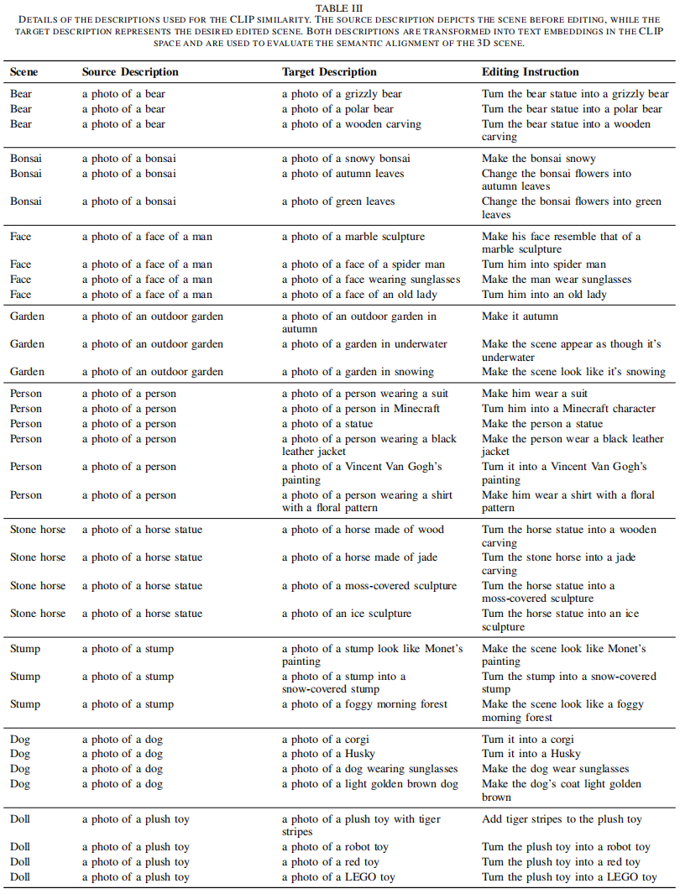

# OEC-GSEdit

	
	
	

An editing framework for consistent 3DGS manipulation. OEC-GSEdit is designed to improve multi-view editing consistency and provide a more stable optimization strategy for complex scene editing.

---

## Method Overview

	

The figure above presents the core pipeline of OEC-GSEdit: while preserving 3D structural consistency, it introduces editing guidance to improve cross-view semantic alignment, reducing inconsistency across multi-view results.

---

## Visual Results

	

From the visualization, the method achieves a good balance between detail preservation and editing objective fulfillment, with clear advantages in multi-view consistency.

---

## Dataset Description

We provide a 3DGS dataset with **10 scenes**, publicly available on Hugging Face:

- Dataset link: https://huggingface.co/datasets/ZaY19/3DGS_datasets/tree/main
- Each scene includes:
	- `images`: multi-view image data
	- `colmap` camera parameters reconstructed by COLMAP
	- Pretrained 3DGS point cloud files for direct editing and experiment reproduction

This data organization directly supports the full pipeline from reconstruction to editing, making reproducible comparisons and further extensions easier.

---

## Instruction Set

Since the current document environment cannot reliably parse all text in the image, the full instruction set is provided as an image below:

| Module | Description |
| --- | --- |
| Instruction Set Overview | See the figure below |

	

---

## Hyperparameter Tuning Guide

With default settings, OEC-GSEdit already provides solid editing results. If GPU memory allows, you can improve performance with the following adjustments:

| Parameter | Adjustment Suggestion | Recommended Scenario |
| --- | --- | --- |
| `max_view_num` | Increase moderately | When stronger multi-view constraints are needed |
| `camera_batch_size` | Increase moderately | When GPU memory is sufficient and you want more stable training |
| `max_steps` | Increase moderately | When aiming for more thorough optimization |
| `guidance_scale` | Use default or slight tuning for local edits; increase to `10` or `15` for scene-level edits | To control editing strength |
| `condition_scale` | Tune when ip2p results are not satisfactory | To improve condition guidance quality |

Additional notes:

- Not all editing tasks can achieve ideal results.
- The editing capability of ip2p has inherent limitations.
- Our key contribution is a new strategy to improve multi-view consistent editing.
- You can also replace ip2p with newer diffusion models while applying our idea for further gains.

---

## Code Release Plan

The code will be released after the paper is published. Stay tuned for updates.
